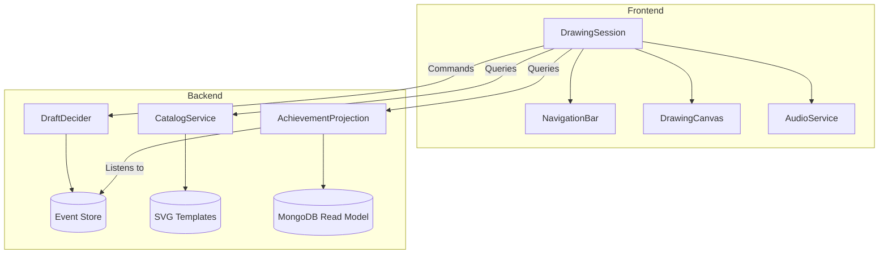
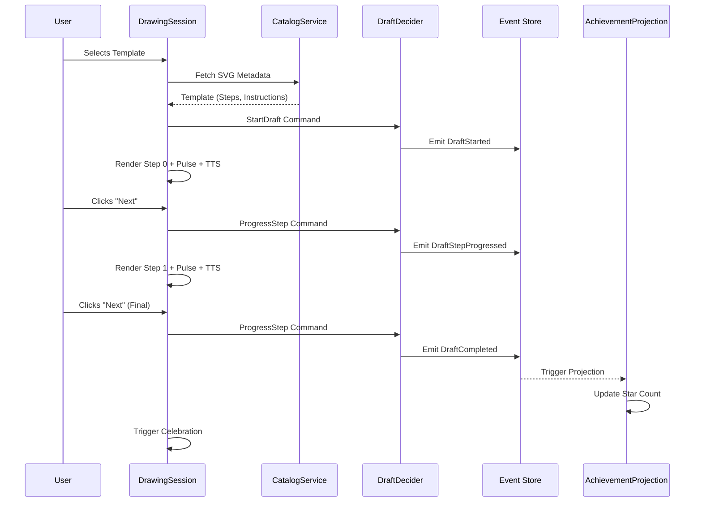

# Master Plan: Visuals

## 🚨 CRITICAL: Read Implementation Guidelines FIRST

**BEFORE implementing ANY part of this master plan**, you MUST read:

📖 **`CursorPrompts/commands/implement_plan.md`**

---

## 📚 Context to Load (MANDATORY)

### Pre-Masterplan Files
| File | Lines / Section | Purpose |
| ---- | --------------- | ------- |
| `01.Summary.master.md` | Section 2 | Proposed solution overview. |

---

## 1. Component Diagram

---

## 2. Sequence Diagram (Happy Path)

